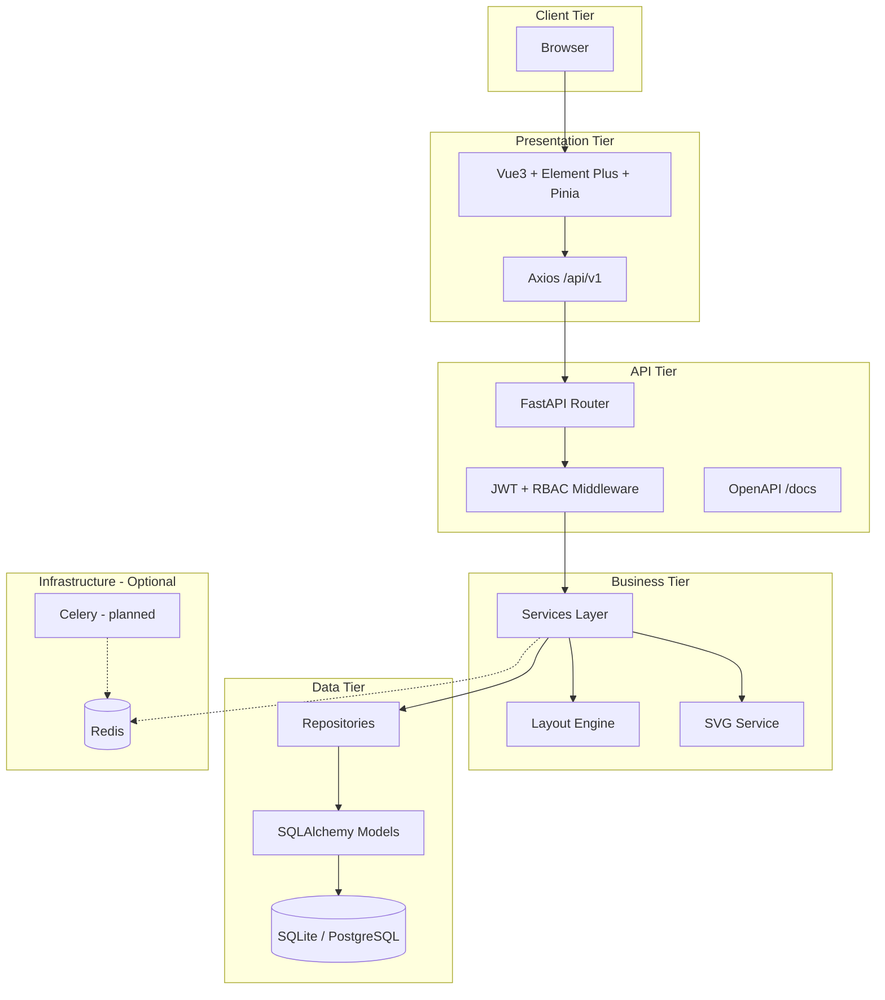
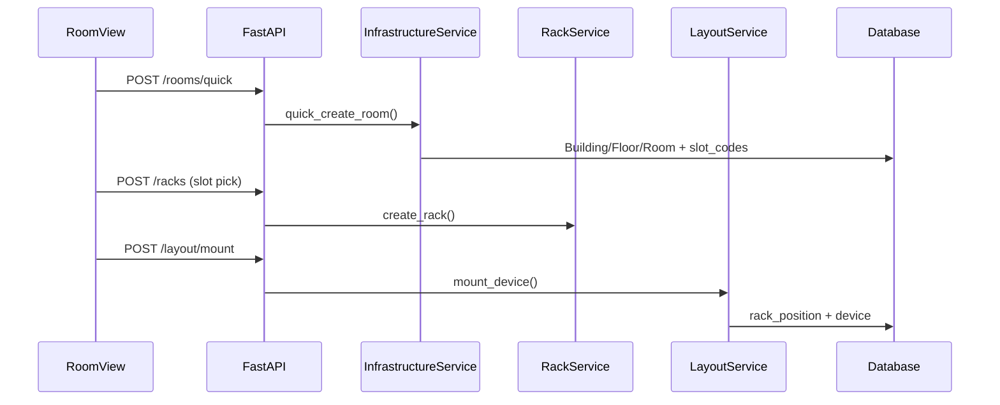

# System Architecture Design

> RackDCIM Pro — Layered Modular Monolith

---

## Revision History

| Version | Date | Author | Description |
| ------- | ---- | ------ | ----------- |
| 1.0.0 | 2026-07-16 | Enzo | Initial |
| 1.2.0 | 2026-07-22 | Enzo | Sync V1 modules |
| 1.3.0 | 2026-07-22 | Enzo | Professional architecture with diagrams & module map |

---

## 1. Architecture Overview

RackDCIM Pro 采用 **模块化单体（Modular Monolith）** 架构：

- **Presentation:** Vue 3 SPA
- **API:** FastAPI REST `/api/v1`
- **Business:** Service + Repository + Domain engine
- **Data:** SQLAlchemy ORM → SQLite (dev) / PostgreSQL (prod)

设计原则：API First、DDD 边界、Documentation Driven Development、AI Ready（无 AI 运行时）。

---

## 2. Logical Architecture



---

## 3. Layered Responsibilities

| Layer | Path | Responsibility | Must Not |
| ----- | ---- | -------------- | -------- |
| Endpoint | `app/api/v1/endpoints/` | HTTP binding, Depends injection | Business rules |
| Schema | `app/schemas/` | Request/response validation | DB queries |
| Service | `app/services/` | Orchestration, rules | Raw SQL in controllers |
| Repository | `app/repositories/` | CRUD, pagination | Cross-aggregate rules |
| Domain | `app/domains/` | Pure algorithms (layout) | HTTP / DB |
| Model | `app/models/` | ORM mapping | Complex business logic |

---

## 4. System Modules

### 4.1 Module Map

| Module | Endpoint File | Service | Frontend |
| ------ | ------------- | ------- | -------- |
| Health | `health.py` | — | — |
| Auth | `auth.py` | `auth.py` | LoginView |
| Dashboard | `dashboard.py` | `dashboard.py` | DashboardView |
| DataCenter | `datacenters.py` | `infrastructure.py` | DatacenterView |
| Building | `buildings.py` | `infrastructure.py` | — |
| Floor | `floors.py` | `infrastructure.py` | — |
| Room | `rooms.py` | `infrastructure.py` | RoomView |
| Rack | `racks.py` | `rack.py` | RackView |
| RackTemplate | `rack_templates.py` | `rack.py` | RackView |
| Device | `devices.py` | `device.py`, `export.py` | DeviceView |
| Contract | `device_contracts.py` | `device_contract.py` | ContractView |
| IP | `ip_addresses.py` | `ip_address.py` | DeviceView (Tab) |
| Layout | `layout.py` | `layout.py` | Device/Rack drawers |
| SVG/Audit | `svg_audit.py` | `svg.py`, `audit.py` | RackCabinet |
| User/Role | `users.py` | `user_mgmt.py` | UserView, RoleView |

Router aggregation: `app/api/v1/router.py`.

### 4.2 Cross-Cutting Concerns

| Concern | Implementation | File |
| ------- | -------------- | ---- |
| Config | Pydantic Settings | `core/config.py` |
| DI | FastAPI Depends | `core/dependencies.py` |
| AuthN | JWT | `core/security.py` |
| AuthZ | RBAC `require_permissions` | `core/dependencies.py` |
| Errors | Unified ErrorResponse | `core/handlers.py` |
| Seed | Default admin, permissions | `core/seed.py` |
| DB init | create_all + SQLite patches | `core/database.py` |

---

## 5. Core Business Flows

### 5.1 Room Quick Create → Rack → Device Mount



### 5.2 Device Import Flow


---

## 6. Technology Stack

| Layer | Technology | Version |
| ----- | ---------- | ------- |
| Frontend | Vue 3 + TS + Vite | 3.5 / 6.0 / 8.x |
| UI | Element Plus | 2.13 |
| Backend | FastAPI | ≥0.115 |
| ORM | SQLAlchemy | ≥2.0 |
| DB (prod) | PostgreSQL | 16 |
| DB (dev) | SQLite + aiosqlite | — |
| Cache | Redis | 7 (compose) |
| Task | Celery | configured, no worker |
| Deploy | Docker Compose + nginx | `deployment/` |

---

## 7. Module Dependencies

```text
User (RBAC)
  └── all write endpoints

Infrastructure (Room)
  └── Rack
        └── RackPosition
              └── Device (mount)
                    └── Layout Engine
                          └── SVG Service
                                └── Dashboard (stats)

Device Contract ──bind──> Device
IpAddress ──bind──> Device | Rack | Room
```

---

## 8. Deployment Architecture (V1)

### 8.1 Development

```text
Vite :5173  --proxy /api-->  Uvicorn :8000  -->  SQLite rackdcim.db
```

### 8.2 Docker Compose

```text
Client :80 (nginx SPA)
         ├── /api/* → backend:8000
         └── /health → backend:8000
backend → postgres:5432, redis:6379
```

**Not in compose:** Celery worker, MinIO, AI gateway, alembic migration job.

---

## 9. Security Architecture (Summary)

| Control | Status | Detail Doc |
| ------- | ------ | ---------- |
| JWT access + refresh | ✅ | [11-Security.md](11-Security.md) |
| RBAC permissions | ✅ | seed + require_permissions |
| bcrypt passwords | ✅ | cost default |
| CORS whitelist | ✅ | config cors_origins |
| Rate limiting | 📋 | — |
| Audit API | ✅ | GET /audit/logs |

---

## 10. Scalability & HA

| Capability | V1 | Future |
| ---------- | -- | ------ |
| Horizontal API | 📋 stateless JWT ready | K8s replicas |
| DB HA | 📋 | PG primary/standby |
| Redis Sentinel | 📋 | — |
| Multi-tenant | 📋 | schema-per-tenant |

---

## 11. Performance Targets

| Metric | Target | Measurement |
| ------ | ------ | ----------- |
| CRUD API | <200ms P95 | 📋 Locust pending |
| SVG generation | <500ms | manual |
| Dashboard | <2s | manual |
| Import 1000 devices | <10s | 📋 sync today |

---

## 12. Future Evolution

| Direction | Description |
| --------- | ----------- |
| AI Agent | MCP tools over OpenAPI ([10-AI-Platform.md](10-AI-Platform.md)) |
| Event Bus | Domain events → Kafka |
| Graph DB | Network topology |
| Microservices | Split by bounded context when scale demands |

---

## References

- [03-Domain-Model.md](03-Domain-Model.md)
- [05-API-Design.md](05-API-Design.md)
- [07-Backend-Design.md](07-Backend-Design.md)
- [12-Deployment.md](12-Deployment.md)
