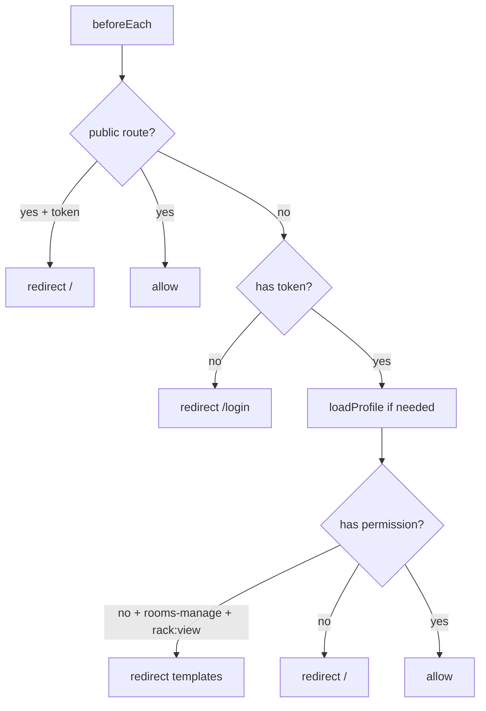

# Frontend Design Specification (FDS)

> SPA architecture — `frontend/src/`

---

## Revision History

| Version | Date | Author | Description |
| ------- | ---- | ------ | ----------- |
| 1.3.0 | 2026-07-22 | Enzo | Complete route map, API modules, components, auth flow |

---

## 1. Overview

| Property | Value |
| -------- | ----- |
| Framework | Vue 3.5 Composition API |
| Language | TypeScript ~6.0 |
| Build | Vite 8 |
| UI | Element Plus 2.13 |
| State | Pinia 3 (auth only) |
| HTTP | Axios 1.13 |
| Charts | ECharts 6 (Dashboard) |
| Dev port | 5173 |
| API proxy | `/api`, `/health` → localhost:8000 |

Config: `frontend/vite.config.ts`.

---

## 2. Project Structure

```text
frontend/src/
├── api/
│   ├── index.ts          # Axios instance + JWT refresh interceptor
│   ├── auth.ts
│   ├── dashboard.ts
│   ├── datacenter.ts
│   ├── room.ts
│   ├── rack.ts
│   ├── device.ts
│   ├── ip.ts
│   ├── contract.ts
│   └── user.ts
├── components/
│   ├── RackCabinet.vue       # SVG rack visualization
│   ├── BatchCreateDeviceDialog.vue
│   └── RackRangePicker.vue   # IP rack range UI
├── layouts/
│   ├── MainLayout.vue        # Sidebar + header
│   └── RoomSectionLayout.vue # Tabs: 机房管理 / 机柜模板
├── router/index.ts
├── stores/auth.ts
├── styles/main.css
├── types/api.ts
├── views/
│   ├── LoginView.vue
│   ├── DashboardView.vue
│   ├── DatacenterView.vue
│   ├── RoomView.vue
│   ├── RackView.vue
│   ├── DeviceView.vue
│   ├── ContractView.vue
│   ├── UserView.vue
│   ├── RoleView.vue
│   └── PlaceholderView.vue   # Unused
├── App.vue
└── main.ts
```

---

## 3. Routing

### 3.1 Route Table

| Path | Name | Component | Permission | Status |
| ---- | ---- | --------- | ---------- | ------ |
| /login | login | LoginView | public | ✅ |
| / | dashboard | DashboardView | auth | ✅ |
| /datacenters | datacenters | DatacenterView | datacenter:view | ✅ |
| /rooms/manage | rooms-manage | RoomView | datacenter:view | ✅ |
| /rooms/templates | room-rack-templates | RackView | rack:view | ✅ |
| /racks | — | redirect → /rooms/templates | — | ✅ |
| /devices | devices | DeviceView | device:view | ✅ |
| /devices/contracts | device-contracts | ContractView | device:view | ✅ |
| /system/users | users | UserView | user:view | ✅ |
| /system/roles | roles | RoleView | role:view | ✅ |

### 3.2 Navigation Guard (`router/index.ts`)



---

## 4. Layout & Menu

### 4.1 MainLayout Sidebar

| Menu Item | Route | Visibility |
| --------- | ----- | ---------- |
| Dashboard | / | Always |
| 数据中心 | /datacenters | datacenter:view |
| 机房管理 | /rooms/manage | datacenter:view OR rack:view |
| 设备管理 ▸ 设备管理 | /devices | device:view |
| 设备管理 ▸ 合同信息 | /devices/contracts | device:view |
| 系统管理 ▸ 用户管理 | /system/users | user:view |
| 系统管理 ▸ 角色管理 | /system/roles | role:view |

机柜模板通过 `RoomSectionLayout` Tab 或 `/rooms/templates` 访问。

### 4.2 RoomSectionLayout

| Tab | Route | Permission |
| --- | ----- | ---------- |
| 机房管理 | /rooms/manage | datacenter:view |
| 机柜模板 | /rooms/templates | rack:view |

---

## 5. Authentication & HTTP

### 5.1 Auth Store (`stores/auth.ts`)

| State | Storage |
| ----- | ------- |
| accessToken | localStorage |
| refreshToken | localStorage |
| profile | memory (loaded on route enter) |

Methods: `login`, `logout`, `loadProfile`, `hasPermission`, `setTokens`, `clearAuth`.

### 5.2 Axios Interceptor (`api/index.ts`)

1. Attach `Authorization: Bearer` on every request
2. On 401 (non-login): attempt refresh via `/auth/refresh`
3. Retry original request with new token
4. On refresh failure: clear auth → redirect `/login`

Helper: `unwrap<T>(response)` extracts `data` from envelope.

---

## 6. API Module Mapping

| Module | File | Backend Prefix |
| ------ | ---- | -------------- |
| Auth | auth.ts | /auth |
| Dashboard | dashboard.ts | /dashboard |
| DataCenter | datacenter.ts | /datacenters |
| Room/Floor | room.ts | /rooms, /floors |
| Rack | rack.ts | /racks, /rack-templates |
| Device | device.ts | /devices, catalogs, /layout |
| IP | ip.ts | /ip-addresses |
| Contract | contract.ts | /device-contracts |
| User | user.ts | /users, /roles, /permissions |

---

## 7. Page Specifications

### 7.1 LoginView ✅

- Form: username + password
- Calls `POST /auth/login`
- Network error → 「无法连接后端」（非密码错误）
- Success → redirect `/`

### 7.2 DashboardView ✅

- Fetches `GET /dashboard/summary`
- Summary cards (DC, room, rack, device counts)
- ECharts utilization display

### 7.3 DatacenterView ✅

- CRUD table for datacenters
- Fields: code, name, location, description

### 7.4 RoomView ✅

- Quick create wizard → `POST /rooms/quick`
- Layout drawer: grid from `row_layout` + `slot_codes`
- Color-coded slot utilization

### 7.5 RackView ✅

- Template management + rack creation
- Slot picker with row/col
- SVG preview via `RackCabinet`
- U-position mount drawer

### 7.6 DeviceView ✅

- Device CRUD table
- Tabs: 设备 / 档案 catalog / IP 管理
- Import/export buttons (permission-gated)
- Batch create dialog
- Mount/unmount integration

### 7.7 ContractView ✅

- Contract CRUD
- Items import (Excel template)
- Device bind/unbind

### 7.8 UserView / RoleView ✅

- User: multi-role assignment, password ≥12 chars
- Role: permission multi-select
- Admin user/role protected in UI + API

---

## 8. Components

### 8.1 RackCabinet.vue ✅

- Renders rack SVG from API or local layout data
- U-slot grid, device blocks, labels
- Used in RackView and Device mount flows

### 8.2 BatchCreateDeviceDialog.vue ✅

- Bulk device creation form
- Validates model codes against catalog

### 8.3 RackRangePicker.vue ✅

- Select rack range for IP binding
- Used in DeviceView IP tab

---

## 9. Permission-Driven UI

```vue
<el-button v-if="auth.hasPermission('device:import')">
  导入
</el-button>
```

`hasPermission` checks exact code or `admin:*`.

---

## 10. Planned Features 📋

| Feature | Status |
| ------- | ------ |
| vue-i18n (zh/en) | 📋 |
| Runtime theme toggle | 📋 |
| Audit log page | 📋 |
| Building/Floor standalone pages | 📋 |
| Route lazy-loading audit | 🚧 partial (dynamic import) |
| Dedicated Pinia stores per domain | 📋 |

---

## 11. Performance Targets

| Metric | Target |
| ------ | ------ |
| First paint | <2s |
| Route switch | <300ms |
| SVG render | <500ms |

---

## 12. Build & Quality

```bash
npm run dev      # Development
npm run build    # vue-tsc + vite build
npm run lint     # ESLint
npm run format   # Prettier
```

CI runs `npm ci && npm run build` on Node 22.

---

## References

- [05-API-Design.md](05-API-Design.md)
- [06-Frontend-Design.md](06-Frontend-Design.md) — this doc
- [09-SVG-Engine.md](09-SVG-Engine.md)
