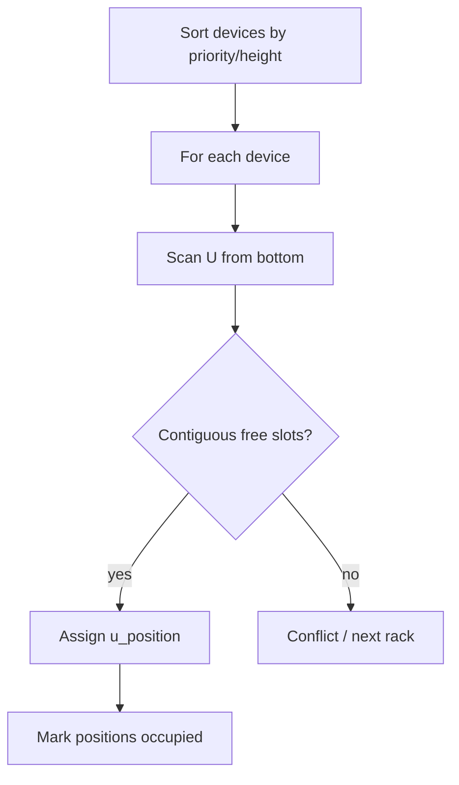
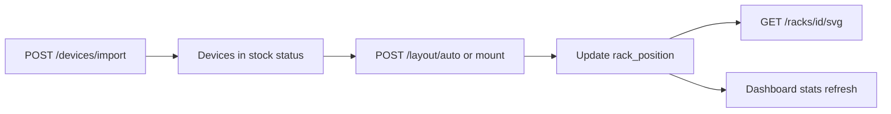

# Layout Engine Design Specification

> Two subsystems: **Room slot layout** (rack positions) + **Rack U layout** (device mount)

---

## Revision History

| Version | Date | Author | Description |
| ------- | ---- | ------ | ----------- |
| 1.3.0 | 2026-07-22 | Enzo | Algorithm spec + API + code paths |

---

## 1. Engine Overview

| Subsystem | Responsibility | Code |
| --------- | -------------- | ---- |
| Room Layout | Grid dimensions, slot_codes generation | `schemas/infrastructure.py`, `InfrastructureService` |
| U Layout | Device mount positions in rack | `domains/layout/engine.py`, `LayoutService` |

The engine **does not** render SVG or persist directly — services commit via repositories.

---

## 2. Room Slot Layout (Layer 1)

### 2.1 Concepts

| Field | Description |
| ----- | ----------- |
| row_layout | `[6,6,8,4]` — cabinets per row |
| layout_mode | `auto`: rows×cols uniform; `manual`: row_layout |
| code_mode | `auto` or `custom` |
| code_prefix | Single letter `A` or range `A-D`, `A-BZ` |
| slot_codes | 2D string matrix aligned to grid |

### 2.2 Auto Numbering

Prefix `A`, 3 columns, 2 rows:

```text
A01  A02  A03
B01  B02  B03
```

Functions:

- `expand_row_prefixes(prefix, row_count)` → list of row letters
- `generate_slot_codes(row_layout, prefix)` → 2D matrix
- `normalize_row_layout(rows, cols, manual)` → canonical layout

### 2.3 Rack Placement Rules

When creating rack at `(row_no, column_no)`:

1. `1 ≤ row_no ≤ len(row_layout)`
2. `1 ≤ column_no ≤ row_layout[row_no - 1]`
3. No existing rack at same coordinates
4. `code`/`name` unique within room

Errors: `10002` conflict, `10004` validation.

---

## 3. Rack U Layout (Layer 2)

### 3.1 U Position Model

- Numbering: **1 = bottom**, `total_u` = top
- Display order in SVG: top-down (42→1)
- Each `RackPosition` row: `{ u_position, occupied, device_id }`

### 3.2 Device Mount Rules

| Rule | Description | Code |
| ---- | ----------- | ---- |
| R1 | Device occupies `height_u` contiguous slots | — |
| R2 | No overlapping devices | 10004 |
| R3 | `u_position + height_u - 1 ≤ total_u` | 10004 |
| R4 | One rack per mounted device | — |
| R5 | Device status → `mounted` on success | — |

### 3.3 Slot States

| State | Meaning |
| ----- | ------- |
| FREE | u_position not occupied |
| USED | device_id set |
| RESERVED | 📋 future |
| BLOCKED | 📋 future |

---

## 4. Algorithms

### 4.1 Bottom-First (Default Auto Layout)



Implemented in `domains/layout/engine.py`:

- `validate_layout(rack, devices)` → conflict list
- `find_slot(rack, height_u, start_u?)` → position or None
- `apply_mount(device, rack, u_position)` → position updates

### 4.2 Manual Mount

`POST /layout/mount` body specifies `device_id`, `rack_id`, `u_position`. Service validates then commits.

### 4.3 Batch Operations

| Endpoint | Behavior |
| -------- | -------- |
| POST /layout/batch-mount | Array of mount requests; partial failure reporting |
| POST /layout/batch-unmount | Array of device IDs |

---

## 5. API Reference

| Method | Path | Service Method |
| ------ | ---- | -------------- |
| POST | /layout/validate | validate only |
| POST | /layout/auto | auto-assign across rack(s) |
| POST | /layout/mount | single mount |
| POST | /layout/unmount | single unmount |
| POST | /layout/batch-mount | batch mount |
| POST | /layout/batch-unmount | batch unmount |
| POST | /racks/{id}/layout | rack-level layout update |

Permission: `device:update` for mount operations.

---

## 6. Conflict Response Example

```json
{
  "code": 10004,
  "message": "U position conflict at U17",
  "details": {
    "rack_id": "...",
    "u_position": 17,
    "conflicting_device_id": "..."
  }
}
```

---

## 7. Import → Layout Workflow



Import does **not** auto-mount in V1 — separate layout step required.

---

## 8. Performance Targets

| Scenario | Target |
| -------- | ------ |
| Single mount | <100ms |
| Validate 42U full rack | <50ms |
| Batch mount 100 devices | <5s |
| Auto layout 500 devices | 📋 <5s goal |

---

## 9. Future Enhancements 📋

| Feature | Description |
| ------- | ----------- |
| Top-first / center balance | Alternative algorithms |
| Reserve U above/below | Cooling gaps |
| GET /layout/result | Persisted layout preview |
| AI layout suggest | See 10-AI-Platform.md |

---

## References

- [03-Domain-Model.md](03-Domain-Model.md)
- [05-API-Design.md](05-API-Design.md)
- [07-Backend-Design.md](07-Backend-Design.md)
- Code: `backend/app/domains/layout/engine.py`
