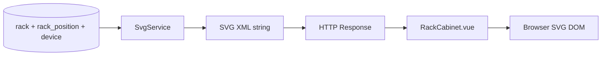

# SVG Rendering Engine Design Specification

> Rack elevation diagrams — backend generation + frontend display

---

## Revision History

| Version | Date | Author | Description |
| ------- | ---- | ------ | ----------- |
| 1.3.0 | 2026-07-22 | Enzo | V1 implementation spec with pipeline & API |

---

## 1. Overview

| Aspect | V1 Implementation |
| ------ | ----------------- |
| Backend | `app/services/svg.py` generates SVG XML string |
| API | `GET /racks/{id}/svg`, `GET /svg/rack/{rack_id}` |
| Frontend | `RackCabinet.vue` renders SVG + interaction |
| Export PNG/PDF | 📋 Not implemented |

---

## 2. Data Flow



The SVG service reads rack layout from DB — it does **not** accept arbitrary Layout JSON POST in V1.

---

## 3. SVG Structure

```text
<svg viewBox="0 0 W H">
  ├── Background
  ├── Rack frame (border, header)
  ├── U-slot grid (lines + labels 42→1)
  ├── Device blocks (rect per mounted device)
  │     └── height = height_u × slot_height
  └── Labels (hostname / model)
</svg>
```

### 3.1 Coordinate System

| Property | Value |
| -------- | ----- |
| Origin | Top-left |
| X axis | Left → right |
| Y axis | Top → bottom |
| U slot height | Computed: total_height / total_u |

### 3.2 Device Block Styling

| Attribute | Source |
| --------- | ------ |
| y, height | u_position, height_u |
| fill color | device status / category (service logic) |
| label | hostname or name |

---

## 4. API

### 4.1 Get Rack SVG ✅

```http
GET /api/v1/racks/{rack_id}/svg
Authorization: Bearer <token>
```

Response: `Content-Type: image/svg+xml` or JSON wrapper depending on endpoint variant.

Alternate route:

```http
GET /api/v1/svg/rack/{rack_id}
```

Permission: `rack:view`.

### 4.2 Planned Endpoints 📋

| Method | Path | Purpose |
| ------ | ---- | ------- |
| GET | /svg/export | Bulk export |
| POST | /svg/render | Custom layout JSON input |

---

## 5. Frontend Component

### 5.1 RackCabinet.vue ✅

| Feature | Status |
| ------- | ------ |
| Load SVG from API | ✅ |
| Display U grid | ✅ |
| Show device blocks | ✅ |
| Basic scaling | ✅ |
| Drag/pan/zoom | 🚧 limited |
| Click device detail | 🚧 |
| Front/rear view | 📋 |
| Export PNG | 📋 |

---

## 6. Color Convention (Target)

| State / Category | Color |
| ---------------- | ----- |
| Free slot | Light gray |
| Server | Blue |
| Network | Orange |
| Storage | Green |
| Maintenance | Yellow |
| Fault | Red |

Exact hex values defined in `svg.py` and component CSS.

---

## 7. Performance

| Metric | Target | V1 |
| ------ | ------ | -- |
| Single rack SVG | <500ms | ✅ typical |
| 100 racks sequential | <30s | 📋 untested |
| Client render | <200ms | ✅ |

Optimization opportunities: cache SVG string in Redis, incremental DOM update.

---

## 8. Export Engine 📋

Planned pipeline:

```text
SVG string → Cairo/rsvg → PNG/PDF
```

Use cases: print rack elevation, attach to audit reports.

---

## 9. Future Evolution 📋

- 3D rack (Three.js)
- Heat map overlay (temperature)
- Power bar per U
- Digital twin integration
- AI natural language rack explanation

---

## References

- [08-Layout-Engine.md](08-Layout-Engine.md)
- [06-Frontend-Design.md](06-Frontend-Design.md)
- Code: `backend/app/services/svg.py`, `frontend/src/components/RackCabinet.vue`
