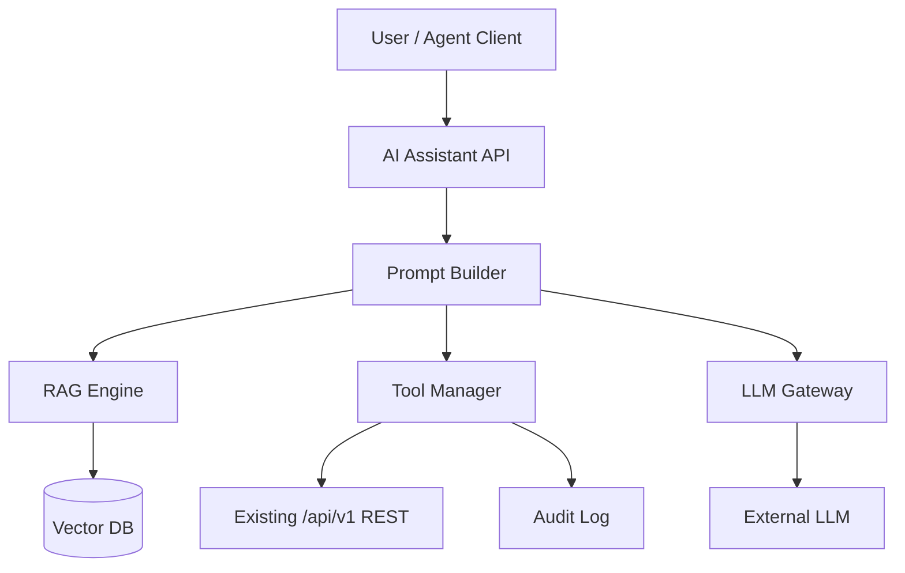

# AI Platform Design Specification

> **Status: PLANNED — No AI code or `/api/v1/ai/*` endpoints exist in V1.**

This document defines the **target architecture** for V3. Implementation must not begin without updating this spec and [01-PRD.md](01-PRD.md).

---

## Revision History

| Version | Date | Author | Description |
| ------- | ---- | ------ | ----------- |
| 1.3.0 | 2026-07-22 | Enzo | Mark V1 gap; refine target architecture |

---

## 1. Current State (V1)

| Component | Status |
| --------- | ------ |
| AI API endpoints | ❌ None |
| LLM integration | ❌ None |
| RAG / vector DB | ❌ None |
| MCP tools | ❌ None |
| Frontend AI UI | ❌ None |

**AI-ready aspects of V1:**

- Complete OpenAPI at `/api/v1/docs`
- Structured JSON responses
- RBAC on all endpoints (future tool auth)
- Audit log table (future AI action logging)

---

## 2. Design Objectives (Target)

| Objective | Description |
| --------- | ----------- |
| AI Native | All business ops callable as tools |
| Multi-model | OpenAI, DeepSeek, Qwen, Claude via gateway |
| Enterprise security | Tool permission = RBAC |
| Auditable | Log every AI-initiated action |
| Offline option | Local Llama for air-gapped deploy |

---

## 3. Target Architecture

---

## 4. Planned Tool Catalog (MCP)

Tools wrap existing REST endpoints:

| Tool | Maps To |
| ---- | ------- |
| list_rooms | GET /rooms |
| list_racks | GET /racks |
| get_rack_svg | GET /racks/{id}/svg |
| find_device | GET /devices?keyword= |
| mount_device | POST /layout/mount |
| calculate_capacity | GET /dashboard/utilization |
| import_devices | POST /devices/import |
| list_contracts | GET /device-contracts |

Each tool invocation: validate JWT + permission + write audit entry.

---

## 5. Planned API Endpoints

| Method | Path | Purpose |
| ------ | ---- | ------- |
| POST | /api/v1/ai/chat | Conversational assistant |
| POST | /api/v1/ai/layout | Layout suggestion |
| POST | /api/v1/ai/report | Report generation |
| POST | /api/v1/ai/agent/run | Multi-step agent |
| GET | /api/v1/ai/history | Session history |

**None implemented in V1.**

---

## 6. RAG Knowledge Base (Planned)

| Source | Use |
| ------ | --- |
| docs/*.md | Product & API context |
| OpenAPI JSON | Tool schema |
| Device models | Hardware specs |
| Audit logs | Historical actions |

Vector store options: pgvector (preferred), Milvus, Qdrant.

---

## 7. Security (Planned)

| Threat | Mitigation |
| ------ | ---------- |
| Prompt injection | Input filter + system prompt isolation |
| Tool abuse | RBAC per tool; confirm destructive ops |
| Data exfiltration | Response sanitization |
| Cost overrun | Token quota per user |

See [11-Security.md](11-Security.md) §13.

---

## 8. Performance Targets (Planned)

| Operation | Target |
| --------- | ------ |
| Chat response | <5s |
| RAG retrieval | <1s |
| Layout suggestion | <10s |
| Streaming | SSE support |

---

## 9. Implementation Roadmap

| Phase | Deliverable | Depends On |
| ----- | ----------- | ---------- |
| P1 | LLM gateway + /ai/chat | API stable ✅ |
| P2 | Tool calling (read-only) | OpenAPI tools |
| P3 | Write tools with confirmation | Audit UI |
| P4 | RAG over docs | pgvector |
| P5 | Multi-agent workflows | P1–P4 |

---

## References

- [01-PRD.md](01-PRD.md) — V3 scope
- [05-API-Design.md](05-API-Design.md) — REST surface for tools
- [11-Security.md](11-Security.md) — AI security section
