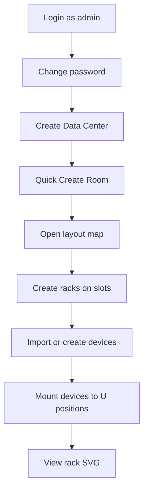

# Operations Guide

> Installation · Daily ops · Troubleshooting · V1 status

---

## Revision History

| Version | Date | Author | Description |
| ------- | ---- | ------ | ----------- |
| 1.3.0 | 2026-07-22 | Enzo | Complete ops runbook + implementation matrix |

---

## 1. Audience & Purpose

| Role | Uses This Guide For |
| ---- | ------------------- |
| 系统管理员 | Install, user mgmt, upgrades |
| 运维工程师 | Daily checks, backup, logs |
| 数据中心管理员 | Business workflows (rooms, racks, devices) |
| 技术支持 | Troubleshooting |

---

## 2. System Requirements

### 2.1 Hardware

| Profile | CPU | RAM | Disk | Network |
| ------- | --- | --- | ---- | ------- |
| Minimum | 4 core | 8 GB | 100 GB SSD | 1 Gbps |
| Recommended | 16 core | 32 GB | 500 GB SSD | 10 Gbps |

### 2.2 Software

| Component | Version |
| --------- | ------- |
| OS | Ubuntu 24.04 / Windows 10+ (dev) |
| Python | 3.12+ |
| Node.js | 20+ (22 in CI) |
| Docker | 24+ (optional) |
| PostgreSQL | 16 (compose) |

---

## 3. Installation

### 3.1 Quick Start (Development)

```powershell
# From DCIM/
.\scripts\dev.ps1
```

Or:

```bash
# Terminal 1
cd backend && uvicorn app.main:app --reload --port 8000

# Terminal 2
cd frontend && npm run dev
```

Verify:

```bash
curl http://localhost:8000/health
# {"status":"ok","version":"1.0.0"}

# Browser: http://localhost:5173
# Login: admin / Admin@12345678
```

### 3.2 Docker Production-Like

```bash
cd deployment
docker compose up -d --build
# Open http://localhost
```

Post-install:

1. Change admin password via UI or API
2. Run `alembic upgrade head` if using external PostgreSQL workflow
3. Create production `.env` with strong secrets

Detail: [12-Deployment.md](12-Deployment.md).

---

## 4. First-Time Setup Workflow



### 4.1 Seed Data (Empty DB)

| Item | Value |
| ---- | ----- |
| Admin | admin / Admin@12345678 |
| Role | admin (all permissions) |
| Rack templates | STD-42U, STD-48U |
| Device types | compute, storage, network, security |
| Sample models | DELL R750-2U, HPE SW-1U |

Source: `backend/app/core/seed.py`.

---

## 5. Daily Operations

### 5.1 Infrastructure

| Task | UI Path | API |
| ---- | ------- | --- |
| Add datacenter | /datacenters | POST /datacenters |
| Quick add room | /rooms/manage | POST /rooms/quick |
| View floor plan | Room → 布局图 | GET /rooms |
| Add rack | /rooms/templates | POST /racks |

### 5.2 Device Operations

| Task | UI Path | API |
| ---- | ------- | --- |
| Create device | /devices | POST /devices |
| Import Excel | /devices → 导入 | POST /devices/import |
| Export Excel/PDF | /devices → 导出 | GET /devices/export |
| Mount to rack | Device/Rack drawer | POST /layout/mount |
| Manage IP | /devices → IP Tab | /ip-addresses |
| Manage contract | /devices/contracts | /device-contracts |

### 5.3 User Administration

| Task | Path | Notes |
| ---- | ---- | ----- |
| Create user | /system/users | Password ≥12 chars |
| Assign roles | User edit dialog | Multi-select |
| Create role | /system/roles | Permission multi-select |
| Never delete | admin user/role | Protected |

---

## 6. Health Monitoring

### 6.1 Health Endpoints

```bash
curl -s http://localhost:8000/health
curl -s http://localhost:8000/api/v1/health
```

### 6.2 Component Status (V1)

| Component | Dev | Docker Compose |
| --------- | --- | -------------- |
| API | ✅ :8000 | ✅ |
| Frontend | ✅ :5173 | ✅ :80 |
| Database | ✅ SQLite file | ✅ PostgreSQL |
| Redis | Optional | ✅ |
| Celery | ❌ | ❌ |
| MinIO | ❌ | ❌ |
| AI | ❌ | ❌ |

### 6.3 Log Locations

| Mode | Logs |
| ---- | ---- |
| Dev uvicorn | Terminal stdout |
| Docker | `docker compose logs -f backend` |
| Audit | GET /api/v1/audit/logs (API only) |

---

## 7. Backup & Recovery

### 7.1 SQLite (Dev)

```bash
copy backend\rackdcim.db backend\rackdcim.db.bak
```

### 7.2 PostgreSQL

```bash
docker compose exec postgres pg_dump -U rackdcim rackdcim > backup.sql
```

Restore:

```bash
docker compose exec -T postgres psql -U rackdcim rackdcim < backup.sql
```

### 7.3 Backup Schedule (Recommended)

| Type | Frequency | Retention |
| ---- | --------- | --------- |
| DB full | Daily | 30 days |
| Config (.env) | On change | Git-ignored secrets vault |

---

## 8. Upgrade & Migration

```bash
# 1. Backup
pg_dump ...

# 2. Pull code / new images
git pull
docker compose build

# 3. Migrate
cd backend && alembic upgrade head

# 4. Restart
docker compose up -d

# 5. Smoke test
curl /health && login test
```

---

## 9. Troubleshooting

### 9.1 Cannot Login

| Check | Action |
| ----- | ------ |
| Backend running | curl /health |
| Wrong password | Reset via DB or re-seed dev DB |
| User locked | Check failed_login_count, locked_until |
| CORS / network | Browser devtools Network tab |

### 9.2 Frontend Shows Network Error on Login

- Backend not started on :8000
- Vite proxy misconfigured
- Firewall blocking localhost

### 9.3 SVG Not Displaying

- Verify `GET /racks/{id}/svg` returns XML
- Check user has `rack:view`
- Clear browser cache

### 9.4 Excel Import Fails

- Use official template from `/devices/import/template`
- Required: hostname, serial_number, model_code
- Check response `errors[]` for row details

### 9.5 Docker Backend Won't Start

```bash
docker compose logs backend
# Common: postgres not healthy, wrong DATABASE_URL
docker compose ps
```

---

## 10. Daily / Weekly / Monthly Checklists

### Daily

- [ ] Dashboard loads, summary correct
- [ ] `/health` returns ok
- [ ] No error spikes in backend logs
- [ ] Backup job succeeded (production)

### Weekly

- [ ] Review disk usage (DB volume)
- [ ] Review user accounts / inactive users
- [ ] Apply dependency patches (npm/pip audit)

### Monthly

- [ ] Restore backup drill
- [ ] Permission audit (roles vs policy)
- [ ] Capacity review via dashboard utilization

---

## 11. Useful Commands

```bash
# Docker
docker compose ps
docker compose logs -f backend
docker compose restart backend
docker compose down

# Database
cd backend && alembic current
cd backend && alembic upgrade head
cd backend && alembic history

# Tests
cd backend && pytest ../tests/unit -v
cd backend && pytest ../tests/integration -v

# Manual seed
python scripts/seed.py
```

---

## Appendix A — V1 Implementation Status

| Capability | Status | Doc |
| ---- | ---- | --- |
| Local SQLite + seed | ✅ | 12-Deployment |
| Room quick create / layout / codes | ✅ | 03, 08 |
| Rack templates + slot picker + batch | ✅ | 05, 08 |
| Device CRUD + catalog + import/export | ✅ | 05, 07 |
| Layout mount/unmount/batch | ✅ | 08 |
| IP management | ✅ | 05 |
| Device contracts | ✅ | 05 |
| User/Role UI | ✅ | 06, 11 |
| Rack SVG | ✅ | 09 |
| Audit API | ✅ | 05 |
| Audit UI | 📋 | 06 |
| Docker Compose | ✅ | 12 |
| CI unit tests | ✅ | 13 |
| CI integration tests | 📋 | 13 |
| Celery / MinIO / AI | 📋 | 10, 12 |

---

## Appendix B — Support Contacts (Template)

| Role | Responsibility |
| ---- | -------------- |
| System Admin | Platform & deploy |
| DBA | PostgreSQL |
| Security Admin | RBAC audit |
| Dev Team | Bug fixes |

---

## References

- [00-Project.md](00-Project.md)
- [05-API-Design.md](05-API-Design.md)
- [12-Deployment.md](12-Deployment.md)
- [13-Test-Plan.md](13-Test-Plan.md)
