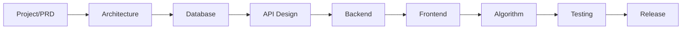

# RackDCIM Pro

> AI Native Data Center Infrastructure Management Platform

---

## Document Conventions

| Symbol | Meaning |
| ------ | ------- |
| ✅ | Implemented in V1 codebase |
| 🚧 | Partially implemented |
| 📋 | Planned (design only) |

**Single Source of Truth:** All implementation must align with `docs/`. When code and docs diverge, update docs first (Documentation Driven Development), then code.

---

## Revision History

| Version | Date | Author | Description |
| ------- | ---- | ------ | ----------- |
| 1.0.0 | 2026-07-16 | Enzo | Initial version |
| 1.1.0 | 2026-07-17 | Enzo | V1 scope: room layout, RBAC UI, import/export |
| 1.2.0 | 2026-07-22 | Enzo | Sync IP, contracts, profiles, layout mount, Docker/CI |
| 1.3.0 | 2026-07-22 | Enzo | Professional rewrite: full structure, status matrix, code paths |

---

## Table of Contents

1. [Project Introduction](#1-project-introduction)
2. [Vision & Objectives](#2-vision--objectives)
3. [Product Scope](#3-product-scope)
4. [V1 Implementation Matrix](#4-v1-implementation-matrix)
5. [Technology Stack](#5-technology-stack)
6. [Repository Structure](#6-repository-structure)
7. [Documentation Index](#7-documentation-index)
8. [Development Workflow](#8-development-workflow)
9. [Coding Standards](#9-coding-standards)
10. [Version & Branch Strategy](#10-version--branch-strategy)
11. [Milestones](#11-milestones)
12. [Future Planning](#12-future-planning)
13. [License](#13-license)

---

## 1. Project Introduction

### 1.1 Background

企业数据中心规模持续扩大，资产类型涵盖服务器、网络、存储、GPU 集群等。大量团队仍依赖 Excel 维护机柜与设备信息，导致数据分散、协作困难、无法容量规划与可视化。

RackDCIM Pro 提供轻量、可私有化部署的 DCIM 平台，以统一数据模型与 REST API 替代手工表格。

### 1.2 Positioning

| Dimension | Description |
| --------- | ----------- |
| Target | 企业 IT、IDC、运维团队 |
| Deployment | 私有化 / Docker Compose |
| Architecture | Modular monolith (FastAPI + Vue3) |
| API | REST `/api/v1`, OpenAPI 3.x |
| AI | Native-ready（V1 无 AI 运行时） |

---

## 2. Vision & Objectives

### 2.1 Vision

打造现代化数据中心基础设施管理平台：数据可视化、资源数字化、自动化上架、容量统计。

### 2.2 Version 1.0 Objectives

| Objective | Status |
| --------- | ------ |
| 数据中心 / 楼栋 / 楼层 / 机房层级 | ✅ |
| 机房快速创建（布局 + 机柜位编号 + 布局图） | ✅ |
| 机柜模板、机柜位选位、批量放置 | ✅ |
| 设备 CRUD、档案 catalog、导入导出 | ✅ |
| U 位自动/手动上架（layout engine） | ✅ |
| 机柜 SVG | ✅ |
| Dashboard（summary / utilization） | ✅ |
| RBAC 用户/角色 UI | ✅ |
| IP 地址管理 | ✅ |
| 设备采购合同 | ✅ |
| 审计日志 API | ✅（无前端 UI） |
| AI 助手 | 📋 |

### 2.3 Version 2.0+ (Planned)

PDU、UPS、配线、CMDB、LDAP、完整 IPAM、Webhook。

### 2.4 Version 3.0+ (Planned)

AI 助手、容量预测、自动布局建议、Digital Twin。

---

## 3. Product Scope

### 3.1 In Scope (V1)

- Infrastructure: DataCenter → Building → Floor → Room
- Rack: Template, placement, SVG, batch ops
- Device: Catalog, mount, import/export
- IP: CRUD, batch, allocate, bind
- Contract: CRUD, items import, device bind
- Identity: JWT + RBAC
- Dashboard & Layout & SVG engines

### 3.2 Out of Scope (V1)

实时监控、温湿度、UPS/PDU 自动控制、视频监控、AI 运行时、MinIO 文件服务、Celery Worker。

---

## 4. V1 Implementation Matrix

| Module | Backend | Frontend | Tests | Doc |
| ------ | ------- | -------- | ----- | --- |
| Auth | ✅ `endpoints/auth.py` | ✅ `LoginView` | ✅ integration | 05, 11 |
| Infrastructure | ✅ | ✅ Datacenter/Room | ✅ integration | 03, 04, 05 |
| Rack | ✅ | ✅ RackView | ✅ integration | 08, 09 |
| Device | ✅ | ✅ DeviceView | ✅ integration | 05, 07 |
| IP | ✅ | ✅ DeviceView Tab | 📋 | 05 |
| Contract | ✅ | ✅ ContractView | 📋 | 05 |
| Layout | ✅ `domains/layout/` | ✅ mount UI | ✅ integration | 08 |
| SVG | ✅ `services/svg.py` | ✅ RackCabinet | ✅ integration | 09 |
| Dashboard | ✅ | ✅ DashboardView | ✅ integration | 05, 06 |
| User/Role | ✅ | ✅ User/Role View | ✅ integration | 11 |
| Audit | ✅ API only | 📋 | 📋 | 05 |
| AI | 📋 | 📋 | 📋 | 10 |
| Celery/MinIO | 📋 config only | — | — | 12 |

**API surface:** ~95 route handlers under `/api/v1` (see `docs/05-API-Design.md`).

---

## 5. Technology Stack

### 5.1 Backend

| Component | Version / Library | Config Path |
| --------- | ----------------- | ----------- |
| Python | ≥3.12 | `backend/pyproject.toml` |
| FastAPI | ≥0.115 | `app/main.py` |
| SQLAlchemy | ≥2.0 | `app/models/` |
| Alembic | ≥1.14 | `alembic/versions/` |
| Pydantic | v2 | `app/schemas/` |
| JWT | python-jose + bcrypt | `app/core/security.py` |
| Excel/PDF | openpyxl, reportlab | `app/services/export.py` |
| Celery | ≥5.4 (configured, no tasks) | `app/core/celery_app.py` |

### 5.2 Frontend

| Component | Version | Path |
| --------- | ------- | ---- |
| Vue | 3.5.x | `frontend/package.json` |
| TypeScript | ~6.0 | `frontend/tsconfig.*` |
| Vite | 8.x | `frontend/vite.config.ts` |
| Pinia | 3.x | `frontend/src/stores/` |
| Element Plus | 2.13.x | views/components |
| Axios | 1.13.x | `frontend/src/api/index.ts` |
| ECharts | 6.x | Dashboard |

### 5.3 Data & Deploy

| Environment | Database | Deploy |
| ----------- | -------- | ------ |
| Development | SQLite (`sqlite+aiosqlite`) | `scripts/dev.ps1` / manual uvicorn + vite |
| Production-like | PostgreSQL 16 | `deployment/docker-compose.yml` |
| Cache | Redis 7 (compose / optional dev) | — |

### 5.4 Default URLs (Development)

| Service | URL |
| ------- | --- |
| Frontend | http://localhost:5173 |
| Backend | http://localhost:8000 |
| OpenAPI | http://localhost:8000/api/v1/docs |
| Health | http://localhost:8000/health |

---

## 6. Repository Structure

```text
rackdcim-pro/
├── backend/                     # 唯一后端入口
│   ├── app/
│   │   ├── api/v1/endpoints/    # router modules
│   │   ├── core/                # config, db, security, seed
│   │   ├── domains/             # layout / domain engines
│   │   ├── models/              # SQLAlchemy ORM
│   │   ├── repositories/
│   │   ├── schemas/             # Pydantic DTOs
│   │   ├── services/            # Business logic
│   │   └── main.py
│   ├── alembic/versions/
│   ├── requirements.txt
│   └── .env.example
├── frontend/                    # 唯一前端入口
│   └── src/
│       ├── api/                 # Axios modules
│       ├── components/
│       ├── layouts/
│       ├── router/
│       ├── stores/
│       └── views/
├── deployment/                  # Docker + nginx
├── docs/                        # This folder (SSOT)
├── scripts/                     # dev.ps1, dev.sh, seed.py
├── tests/                       # unit + integration
├── .github/workflows/ci.yml
├── README.md
└── LICENSE
```

---

## 7. Documentation Index

| Doc | Title | Audience |
| --- | ----- | -------- |
| [00-Project.md](00-Project.md) | Project overview | All |
| [01-PRD.md](01-PRD.md) | Product requirements | PM, Dev |
| [02-System-Architecture.md](02-System-Architecture.md) | Architecture | Architect |
| [03-Domain-Model.md](03-Domain-Model.md) | Domain model | Backend |
| [04-Database-Design.md](04-Database-Design.md) | Database DDL & migrations | DBA, Backend |
| [05-API-Design.md](05-API-Design.md) | REST API specification | Full-stack |
| [postman/README.md](postman/README.md) | Postman Collection 导入与同步 | QA, Dev |
| [06-Frontend-Design.md](06-Frontend-Design.md) | Frontend FDS | Frontend |
| [07-Backend-Design.md](07-Backend-Design.md) | Backend BSD | Backend |
| [08-Layout-Engine.md](08-Layout-Engine.md) | Layout algorithm | Backend |
| [09-SVG-Engine.md](09-SVG-Engine.md) | SVG rendering | Full-stack |
| [10-AI-Platform.md](10-AI-Platform.md) | AI platform (planned) | Future |
| [11-Security.md](11-Security.md) | Security architecture | SecOps |
| [12-Deployment.md](12-Deployment.md) | Deployment | DevOps |
| [13-Test-Plan.md](13-Test-Plan.md) | Testing strategy | QA |
| [14-Roadmap.md](14-Roadmap.md) | Operations guide | Ops |
| [16-Model-Design.md](16-Model-Design.md) | 模型设计 / 拓扑布线与端口池 | PM, Full-stack |
| [17-Interface-Rules.md](17-Interface-Rules.md) | 接口编号与布线对称规则 | PM, Full-stack |

---

## 8. Development Workflow



1. Update the relevant doc in `docs/`.
2. Implement backend service + endpoint + schema.
3. Add frontend API module + view.
4. Add tests; extend CI when stable.
5. Update `14-Roadmap.md` implementation status.

**Quick start:**

```powershell
# Windows
.\scripts\dev.ps1

# Or manually
cd backend && .\.venv\Scripts\Activate.ps1 && uvicorn app.main:app --reload --port 8000
cd frontend && npm run dev
```

---

## 9. Coding Standards

### 9.1 Python

- Python 3.12+, type hints required
- Format: Black; Lint: Ruff
- Business logic in `services/`, not in endpoints
- Repository pattern for data access
- Exceptions: `AppError` hierarchy (`app/core/exceptions.py`)

### 9.2 TypeScript / Vue

- Composition API + `<script setup>`
- ESLint + Prettier
- API calls via `src/api/*`, unwrap with `unwrap<T>()`
- Permission checks via `authStore.hasPermission()`

### 9.3 API

- Prefix: `/api/v1`
- Envelope: `{ code, message, data, timestamp }`
- Pagination: `{ items, pagination: { page, page_size, total, pages } }`
- Auth: `Authorization: Bearer <access_token>`

### 9.4 Database

- UUID primary keys, snake_case columns
- Soft delete: `deleted_at IS NULL`
- Audit columns on `BaseModel`: created/updated/deleted + version

---

## 10. Version & Branch Strategy

**Semantic Versioning:** `MAJOR.MINOR.PATCH` (app version `1.0.0` in `config.py`).

**Git Flow:**

| Branch | Purpose |
| ------ | ------- |
| `main` | Production-ready |
| `develop` | Integration |
| `feature/*` | Features |
| `bugfix/*` | Fixes |
| `hotfix/*` | Urgent production fixes |

---

## 11. Milestones

| ID | Milestone | Status | Evidence |
| -- | --------- | ------ | -------- |
| M1 | Project init | ✅ Done | Repo structure |
| M2 | PRD | ✅ Done | `01-PRD.md` |
| M3 | Architecture | ✅ Done | `02-System-Architecture.md` |
| M4 | Database | ✅ Done | Alembic 0001–0016 |
| M5 | Backend | ✅ Done | 15 endpoint modules |
| M6 | Frontend | ✅ Done | 8 views + 2 layouts |
| M7 | Layout Engine | ✅ Done | mount/unmount/batch |
| M8 | SVG Engine | ✅ Done | svg service + RackCabinet |
| M9 | Testing | 🚧 In progress | 6 test files; CI unit only |
| M10 | Release | 🚧 In progress | Docker compose ready |

---

## 12. Future Planning

| Area | Priority | Doc |
| ---- | -------- | --- |
| Audit log UI | High | 06, 14 |
| Integration tests in CI | High | 13, 12 |
| Celery async import | Medium | 07, 12 |
| AI Assistant | Low (V3) | 10 |
| CMDB / Cable / PDU | V2 | 01, 03 |

---

## 13. License

Apache License 2.0 — see [LICENSE](../LICENSE).

---

## References

- [01-PRD.md](01-PRD.md)
- [05-API-Design.md](05-API-Design.md)
- [14-Roadmap.md](14-Roadmap.md)
