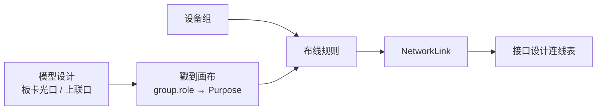

# 接口与布线规则

> 定义设备模型接口编号约定，以及拓扑「组管理 + 布线规则」的连线对称原则。  
> 与模型设计、拓扑设计、接口设计联表配合使用，参见 [16-Model-Design.md](16-Model-Design.md)。

---

## Document Conventions

| Symbol | Meaning |
| ------ | ------- |
| ✅ | 已在代码中落地 |
| 🚧 | 部分落地 / 规则已定、编号样式待统一 |
| 📋 | 产品规则已定，实现待补齐 |

**Single Source of Truth：** 本文描述产品规则；实现路径以代码为准。规则与代码不一致时，先改文档再改代码（Documentation Driven Development）。

---

## 1. 范围与角色

| 环节 | 职责 |
| --- | --- |
| 模型设计 | 定义板卡光口数、上联口数、面板 `slots_def` / `group.role` |
| 拓扑设计 · 组管理 | 将设备划入设备组（同角色 / 主备 / 互联） |
| 拓扑设计 · 布线规则 | 按连接类型、端口池、对称规则自动生成连线 |
| 接口设计 | 展示连线表、Excel 导入导出 |

---

## 2. 设备模型接口编号

### 2.1 通用原则

1. **下联 / 业务口（板卡光口）**：按物理行列顺序连续编号，默认上排先左→右，再下排左→右（「上 1、下 2」类推）。
2. **上联口**：与下联口分区编号，不与业务口混编；数量由模型 `uplink_count` 决定，随配置扩容。
3. **编号随模型数量变化**：`optical_card_count × optical_ports_per_card`（或 `downlink_count`）决定业务口总数；`uplink_count` 决定上联口总数。

### 2.2 千兆交换机（gigabit / ACCESS）

| 区域 | 产品编号规则 | 当前实现 ✅/🚧 |
| --- | --- | --- |
| 下联口 | `1 … N`（N = 板卡光口合计，常见 48） | ✅ 标签 `1…N`，`group.role=main`，多为 `1g` |
| 上联口 | 接在业务口之后连续编号，如业务 1–48 时上联为 `49–54`（随 `uplink_count` 扩容） | 🚧 标签为 `U1…Uk`，`group.role=uplink`，多为 `10g` |

### 2.3 万兆 / 汇聚交换机（ten_gigabit / aggregation）

| 区域 | 产品编号规则 | 当前实现 ✅/🚧 |
| --- | --- | --- |
| 下联口 | `1 … N`（多为 `10g`） | ✅ `1…N`，`role=main` |
| 上联口 | 业务口之后连续编号（如 `49–52` / `49–56`），或独立上联编号段 | 🚧 标签 `U1…Uk`，多为 `40_100g` |

### 2.4 核心交换机（core · 板卡机箱）

1. **板卡位置**：机箱内由下往上编号板卡 1、板卡 2…（与槽位顺序一致）。
2. **板卡内接口**：按该板卡定义的接口类型与数量分别连续编号，例如：
   - 40G/100G：`1 … M`
   - 10G：`1 … P`
   - 1G：`1 … Q`
3. 布线匹配时，高速率口默认归入上联池；板卡业务口归入光口池（见 §5）。

| 规则 | 状态 |
| --- | --- |
| `line_cards[]` 驱动面板 | ✅ |
| 板卡序号「由下往上」与 UI 一致 | 🚧 以 `slots_def` 顺序为准，需与机箱示意校验 |
| 板卡内按类型分段编号 | ✅ / 🚧 与 `card_type` + `port_count` 对齐 |

### 2.5 编号样式统一（规划）

产品期望上联采用「业务口后续号」（49–54）；当前引擎使用 `U*` 前缀以便与业务口数字编号区分，并支撑端口池过滤。

| 方案 | 说明 | 状态 |
| --- | --- | --- |
| A. 保持 `1…N` + `U1…Uk` | 与端口池 / Purpose 打标已对齐 | ✅ 现行 |
| B. 统一为全局连续号 | 上联 = `main_count+1 … main_count+uplink_count` | 📋 待切换时需同步布线范围与导入导出 |

切换到方案 B 前，布线「端口范围」对上联口按 **标签中的数字** 解析（`U3` → `3`）。

---

## 3. 设备组规则

1. **组管理**：将两台或多台设备划入同一设备组；同组表示相同角色 / 功能 / 主备 / 互联 / 冗余关系。
2. **一台设备可同时属于多个组**；组管理中按组成员勾选即可叠加归属。
3. 布线规则通过 `source_groups` / `target_groups`（可多选；兼容旧字段 `source_group` / `target_group`）或角色匹配组成员。
4. 组目录可带统一角色与描述；成员写入节点 `device_group` / `network_role`，需保存拓扑持久化。

状态：✅ 拓扑「组管理」弹窗 + 布线源/目标设备组。

---

## 4. 布线对称规则

以下为产品规则；引擎按「端口池 + Purpose + 对称配对」逐步落地。

### 4.1 组内对称机柜（交换机组）

当两台（或多台）交换机同组时：

1. **对外下联 / 上联对称**：组内设备 **相同编号的接口**，接到对端设备 **同一角色端口区** 的不同接口上（例如都接到对端下联区，或都接到对端上联区）。
2. **Peer-Link / 堆叠**：组内使用 **相同编号段**；建议从该设备端口号段 **尾部** 预留，例如 `35-36` 口互联（或上联池尾部 `U*`）。
3. **两台一组时**：相同编号口接到 **同一台对端设备** 的不同接口上（主备各一根）。

| 规则项 | 状态 |
| --- | --- |
| 设备组匹配 | ✅ |
| Peer-Link 端口范围 / 上联池 | ✅ |
| 「同号对称」硬约束（card/port diversity） | ✅ 组对称：同源组同号 → 同目标不同口；占用则顺延 |
| 尾部预留 Peer 口默认范围 | 📋 可在规则中手填 `peer_port_range` |

### 4.2 交换机组 → 单台服务器

同一交换机组连接一台服务器时：

- 组内各交换机的 **相同编号接口**，接到该服务器 **不同 Slot** 上的 **相同编号口**。  
  例：交换机 A/B 的 `1` 口 → 服务器 `Slot1` 的 `1` 口与 `Slot2` 的 `1` 口。

| 规则项 | 状态 |
| --- | --- |
| SERVER 连接类型 + 设备多样性 | ✅ |
| Slot 对齐（同号） | 🚧 依赖服务器面板 slot 编号与 `card_diversity` |

### 4.3 交换机组 → 服务器组

1. 服务器组内多台设备时，**各服务器接线方式一致**（相对 Slot / 口编号对称）。
2. 交换机侧按接口序号递增；服务器侧从组内 **编号最小的设备** 开始自动分配连线。

| 规则项 | 状态 |
| --- | --- |
| 组到组匹配 | ✅ 角色/组 |
| 「最小设备优先」排序 | 🚧 当前按匹配列表顺序，可增强为按名称/序号排序 |

### 4.4 典型场景表

| 场景 | Source → Target | Connection | 端口池（默认） | 说明 |
| --- | --- | --- | --- | --- |
| 核心上联 | CORE → AGG | UPLINK | UPLINK → OPTICAL | 源吃上联口，目标吃板卡光口 |
| 接入服务器 | ACCESS 组 → SERVER | SERVER | OPTICAL → OPTICAL/SERVER | 建议开启 A/B + 设备多样性 |
| 堆叠互联 | ACCESS ↔ ACCESS | PEER | UPLINK → UPLINK | Peer-Link 尾部口段 |
| 心跳 | 同组 | DAD | UPLINK → UPLINK | 与 PEER 类似，可单独范围 |

---

## 5. 端口池与 Purpose

与 [16-Model-Design.md](16-Model-Design.md)「端口池与模型板卡/上联」一致。

| 端口池 | 模型来源 | layout / `group.role` | 典型 Purpose |
| --- | --- | --- | --- |
| `OPTICAL`（板卡光口） | `optical_card_count × optical_ports_per_card` | `main` / `card`，标签 `1…N` | DOWNLINK / SERVER |
| `UPLINK`（40/100G 上联） | `uplink_count` | `uplink`，标签 `U1…Uk`（规划可为续号） | UPLINK / PEER / DAD |

- 配置字段：`source_port_pool` / `target_port_pool` = `AUTO | OPTICAL | UPLINK`
- **AUTO**：按 Purpose 推导——`UPLINK`/`PEER`/`DAD` → 上联池；`DOWNLINK`/`SERVER` → 板卡光口池
- 画布加载时按 `group.role` 补全 Purpose，纠正旧面板误标
- 规则 UI 展示匹配设备的板卡光口 / 上联口「合计与空闲」数量，便于填写端口范围与 Link Count

状态：✅

---

## 6. 连接类型默认映射

| Connection（UI） | 源 Purpose | 目标 Purpose | 源池 | 目标池 | 默认 Speed |
| --- | --- | --- | --- | --- | --- |
| 接入到服务器/安全设备 `ACCESS_ENDPOINT` | DOWNLINK | SERVER | OPTICAL | OPTICAL | 10G |
| BMC到服务器/安全设备 `BMC_ENDPOINT` | MGMT | MGMT | AUTO | AUTO | 1G |
| 核心/汇聚到接入交换机 `CORE_TO_ACCESS` | UPLINK | DOWNLINK | UPLINK | OPTICAL | 100G（Speed Mode=MIN） |
| 交换机到交换机互联 `SWITCH_INTERCONNECT` | PEER | PEER | UPLINK | UPLINK | 100G |

旧值 `UPLINK`/`SERVER`/`PEER` 等会在加载时迁移为上表四类。互联口不参与普通业务布线。

---

## 7. 操作要点（拓扑设计）

1. 从模型库单个放置，或批量选择模型、数量、设备组和网络角色。
2. 批量生成后自动紧凑排版；也可用「智能布局」重排，或继续手工移动。
3. **组管理**：创建组、添加成员、统一角色。
4. **布线规则**：按源/目标角色或组执行；「一键自动布线」批量执行所有启用的 `AUTO` 规则，手动/混合规则仍逐条确认。
5. 需要时可 **撤销执行**（按 `wiring_rule_id` 删除该规则生成的连线）或单条 **删除连线**。
6. **保存布局** 后，在「接口设计」查看精简端子表或详细设计表，并导出 Excel。

---

## 7.1 端子表输出

- 页面默认使用精简端子表，仅保留本端/对端设备类型、名称、位置、U 位、接口、接口类型、线缆类型和两端标签；可切换详细设计表查看类型、位置、U 位、介质、LAG、冗余等信息。
- Excel 导出固定为 14 列端子对照表，带冻结表头、筛选、列宽和深色标题样式。
- Excel 导入模板继续保留 30 列完整字段，确保规则 ID、节点 ID、接口 ID 等高级批量维护能力不丢失。

---

## 8. 实现对照与后续

| 编号 | 规则 | 状态 |
| --- | --- | --- |
| IR-01 | 业务口 `1…N` 自动编号 | ✅ |
| IR-02 | 上联口随 `uplink_count` 扩容 | ✅ |
| IR-03 | 上联连续号 49–54（方案 B） | 📋 |
| IR-04 | 核心板卡由下往上编号 | 🚧 |
| IR-05 | 设备组管理 | ✅ |
| IR-06 | 组内对外同号对称 | ✅ |
| IR-07 | Peer-Link 尾部同号段 | 🚧 / 可配置范围 ✅ |
| IR-08 | 交换机组→服务器 Slot 同号 | 🚧 |
| IR-09 | 服务器组最小序号优先 | 🚧 |
| IR-10 | 端口池关联模型板卡/上联 | ✅ |

---

## 9. 相关文档与代码

| 文档 / 代码 | 说明 |
| --- | --- |
| [16-Model-Design.md](16-Model-Design.md) | 模型属性、端口池、布线配置分区 |
| `frontend/src/utils/wiringRuleApply.ts` | 布线执行与端口过滤 |
| `frontend/src/utils/wiringTypes.ts` | 规则配置类型与连接类型副作用 |
| `frontend/src/utils/fabricRole.ts` | Purpose / 端口池计数 |
| `frontend/src/utils/networkPortLayout.ts` | 面板生成与口标签 |
| `backend/app/schemas/wiring_rule_config.py` | 后端配置校验 |

---

## Revision History

| Version | Date | Author | Description |
| --- | --- | --- | --- |
| 1.0.0 | 2026-08-11 | Enzo | 初稿：编号约定与布线对称规则草稿 |
| 1.1.0 | 2026-08-11 | Enzo | 结构化改写：对齐端口池/组管理实现，补状态矩阵与操作流 |
| 1.2.0 | 2026-08-17 | Codex | 同步专业模型预设、批量智能布局、一键自动布线与精简端子表 |
